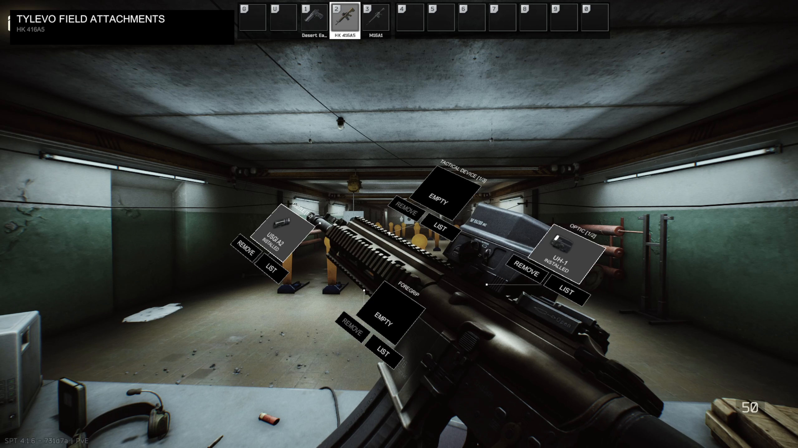
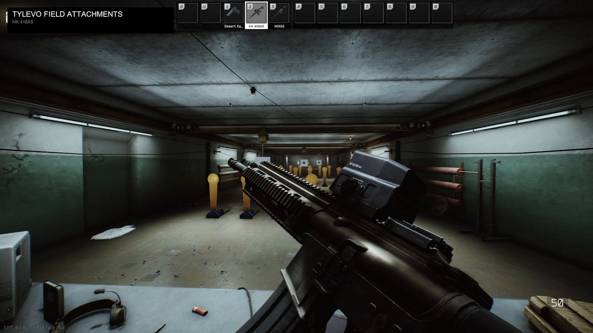

# Tylevo Field Attachments

Change optics, muzzle devices, tactical devices and foregrips without opening your inventory. Left Alt brings up attachment cards around your weapon and lets you use the mouse to choose a part.

**1.0.0 · SPT 4.1.5 / 4.1.6 · BepInEx client plugin**

[Installation](#installation) · [Controls](#controls) · [Compatibility](#compatibility-and-coverage)

*Original HK416 gameplay showing the attachment cards and weapon presentation.*

View the HK416 inspection frame

## What it does

- Shows cards for **optics, muzzle devices, tactical devices and foregrips** that follow your weapon, with item thumbnails where available.
- Installs into an empty slot, removes an installed part or replaces it with a carried alternative.
- Shows compatible parts you've examined and are carrying in accessible pockets, rig, backpack or secure container. The game's restrictions on changing parts in raid still apply.
- Lets you cycle between mounting points, including different handguard positions. The slot count and connection line identify the selected point.
- Moves an assembled **optic and mount together**, keeping the sight attached.
- Holds your weapon at an angle so you can see its attachments. Normal weapon inspection still works separately.

**Attachment changes are off on a fresh install.** Browsing still works. Enable **F12 → General → Allow attachment changes** to install, replace or remove parts.

## Installation

Requires **SPT 4.1.5 or 4.1.6 (EFT 40743)**, **BepInEx 5**, and a compatible [UnityToolkit 2.0.2 or newer](https://github.com/ArysWasTaken/UnityToolkit). The weapon packs listed below are optional.

1. Close the game. Back up an existing `BepInEx/plugins/Tylevo.FieldAttachments/` folder and `BepInEx/config/com.tylevo.fieldattachments.cfg` before updating.
2. Merge a packaged plugin release's `BepInEx` folder into your SPT game folder. Keep the plugin's `Animation` folder alongside its DLL and keep only one copy of the Field Attachments DLL installed.
3. Preserve your existing configuration when updating. A plugin-only update keeps saved settings; older tester packages may include a preset that replaces them.
4. Enter the hideout shooting range or a local raid with a supported weapon. Hold **Left Alt** to open the cards and use the cursor. Release it to close.

## Controls

Left Alt opens the menu and gives you mouse control in both Hold and Toggle modes. Choose the mode you prefer in **F12 → Controls → Menu activation**. Hold is the default.

| Action | Current control |
| --- | --- |
| Open the menu and control the mouse | Hold **Left Alt**, or press it in Toggle mode |
| Cancel attachment mode | Perform an action such as sprinting, press **Left Alt** again in Toggle mode, or release it in Hold mode |
| Show carried choices for a card | Click **LIST** |
| Install or replace a part | Click its thumbnail in **LIST** |
| Remove a part | **REMOVE** on its card, or **NONE** in **LIST** |
| Change mounting point | **Left Alt + R** while the cursor is active |
| Close the open list | Right-click while the cursor is active |
| Open mod settings | **F12** |

In Toggle mode, you can let go of Alt and keep using the mouse. Using Alt+R or clicking while Alt is held keeps the menu open; tap Alt on its own to close it.

Alt+R cycles mounting points for the open list or the card under your cursor. It won't swap a part until you choose one.

## How attachment changes work

Click **LIST** to see the parts you're carrying that fit the selected mount. Choose one and your character lowers the weapon to make the change. After a successful change, the weapon returns to the attachment view if you still have the menu open.

Leave room in your gear for anything you remove. When replacing a part, the old one goes into your inventory before the new one is fitted. If fitting the new part fails, the old one stays in your inventory and the weapon's slot may be empty.

The menu uses parts you're carrying, not items in your stash. A sight on its own won't show up if its required mount is missing from the weapon.

Mouse clicks stay in the menu, so selecting a part won't fire your weapon. Closing the menu stops changes that haven't started yet, but it can't undo an item move already underway.

## Settings

Press **F12** to change the menu key, choose Hold or Toggle, and adjust cursor speed. You can also turn item thumbnails and the cards' weapon-following movement on or off.

Custom attachment animations are always enabled.

**Attachment animation speed** controls how quickly parts are fitted or removed. It defaults to **1.12×**, with a range of **1.0–1.15×**. It leaves normal inspection, firing and reloading speeds alone.

## Compatibility and coverage

| Area | Current scope |
| --- | --- |
| Game versions | SPT 4.1.5 / 4.1.6 (EFT 40743) |
| Where it works | Local raids and the hideout shooting range |
| Fika | Attachment changes are not supported |
| Weapons | 159 SPT weapon entries plus 35 from the optional packs below, for 194 total |
| Other weapon mods | Support must be added for each weapon; unlisted weapons won't work automatically |

You don't need these packs to use Field Attachments with SPT's standard weapons. The 35 added weapon entries come from:

| Optional pack | Supported entries | Examples |
| --- | ---: | --- |
| [WTT - Content Backport](https://forge.sp-tarkov.com/mod/2512/wtt-content-backport) | 13 | M16A1, M16A2, Howa Type 20 |
| [Epic's All in One](https://forge.sp-tarkov.com/index.php/mod/1263/epics-all-in-one) | 16 | Mk47 Mutant 5.45/9×39 variants, MCX 5.56, M700 .277 Fury |
| [ECOT - Eukyre's Consortium of Things](https://forge.sp-tarkov.com/mod/2195/ecot-eukyres-consortium-of-things) | 6 | HK337, FNX-45 Tactical, Glock 22, MP5/40, UMP .40 |

If you add a pack, use a release that matches your SPT version and install its listed dependencies. These counts cover the weapons currently supported; new additions to a pack won't automatically be supported.

Some supported weapons have no attachment slots to change. Not every weapon and clothing combination has been tested in game yet.
